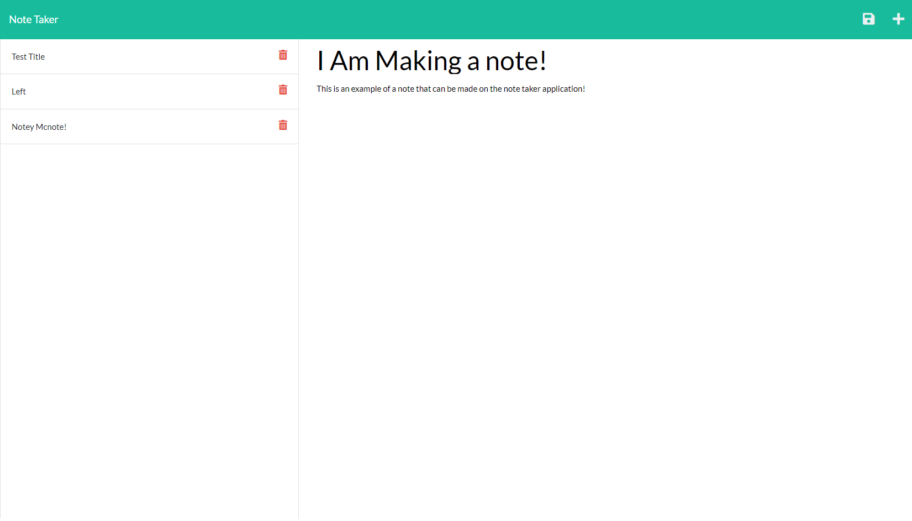

# Note Taker Application

## Table of contents

---

> [Description](#description)
>
> [Installation](#installation)
>
> [Usage](#usage)
>
> [Licenses](#licenses)
>
> [Contributions](#contributions)
>
> [Tests](#tests)
>
> [Questions](#questions)

## Description

---

This is an application that allows the user to persistently save notes with a title and body of text. It opens to a main page that presents the application with a button that takes you to the note taking page. On the page with the note taking function the right side of the screen allows you to input a note title and text note body with a button to save it in the top right corner. It displays saved notes on the left side of the screen with the ability to click on them and see old notes. The display on the left also has a button that allows for the deletion of the old notes. It functions using express for doing requests and storing the data persistently in json format.

[Note Taker Application](https://hidden-beyond-77491.herokuapp.com/notes)

## Usage

---

This application can be used to take notes and have the notes remain persistently until you want to remove the notes yourself.

## Installation

---

This application is a web application with a live deployment on heroku.

## License

---

Licensed with the ISC license : 

## Contributions

---

Express was used for requests and uuid was used to allow for the generation of unique id numbers.

## Tests

---

## Questions

---

If you have any questions you can reach out on my GitHub at:

[TateFoster](https://github.com/TateFoster)

or email me at:

[tate.j.foster@gmail.com](mailto:tate.j.foster@gmail.com)
